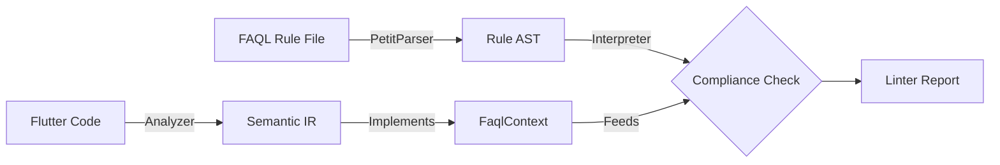

# FAQL Implementation Guide (Internals)

**Target:** Compiler Engineers & Linter Maintainers
**Scope:** Architecture, Interfaces, and Error Handling Strategy

## 1\. Architecture Overview

The FAQL Linter operates as a decoupled module. It does not know about Flutter directly; instead, it talks to a generic abstraction layer (`FaqlContext`).



### 1.1 Components

1.  **Grammar Definition (`grammar.dart`):** Defines the syntax rules using PetitParser.
2.  **Parser Definition (`parser.dart`):** Converts the parse result into strong Dart objects (`FaqlRule`, `Selector`, `LogicNode`).
3.  **Interpreter (`interpreter.dart`):** Traverses the Rule AST and calls methods on the `FaqlContext`.
4.  **Context Bridge (`ir_bridge.dart`):** The implementation of `FaqlContext` that wraps your specific Semantic IR.

-----

## 2\. The Context Interface (The Contract)

To evaluate a rule, the Interpreter needs a standard way to ask questions about a node. This interface abstracts away the complexities of the Flutter Analyzer.

**File:** `lib/src/faql/context.dart`

```dart
/// The bridge between the FAQL Interpreter and the Semantic IR.
/// Implement this class to wrap your specific SemanticNode representation.
abstract class FaqlContext {
  // --- Identity ---
  
  /// The generic role of this node (e.g., 'button', 'textField').
  /// Mapped from SemanticsFlag or Widget Type.
  String get role;
  
  /// The raw Dart class name of the originating Widget (e.g., 'InkWell').
  String get widgetType;

  // --- State Booleans ---
  
  bool get isFocusable;
  bool get isEnabled;
  bool get isHidden;
  bool get mergesDescendants;
  
  /// True if the node has a tap handler (onTap is not null).
  bool get hasTap;
  bool get hasLongPress;

  // --- Graph Relations ---
  
  /// Immediate children in the generic context wrapper.
  List<FaqlContext> get children;
  
  /// The path from the root down to the parent of this node.
  List<FaqlContext> get ancestors;
  
  /// Other children of the same parent (excluding self).
  List<FaqlContext> get siblings;

  // --- AST Access ---

  /// Retrieves a named argument from the widget constructor AST.
  /// Returns [null] if the property is missing or cannot be resolved.
  ///
  /// Example: prop("divisions") on Slider -> 5
  Object? getProperty(String name);
  
  /// Returns true if the property exists and is statically resolvable.
  bool isPropertyResolved(String name);
}
```

-----

## 3\. Selector Mapping Strategy

The interpreter will match rules based on string identifiers. The implementation must map these strings to Flutter's internal types.

### 3.1 Role Mapping

When the rule says `on role(button)`, the bridge checks:

```dart
// Pseudo-code implementation in Bridge
String get role {
  if (flags.contains(SemanticsFlag.isButton)) return 'button';
  if (flags.contains(SemanticsFlag.isTextField)) return 'textField';
  if (flags.contains(SemanticsFlag.isHeader)) return 'header';
  // ... default
  return 'generic';
}
```

### 3.2 Kind Mapping (Macros)

The `kind` selector is a macro. The generic implementation should handle this via a static lookup map to avoid hardcoding "kinds" into the grammar.

```dart
static final Map<String, List<String>> kindDefinitions = {
  'input': ['textField', 'slider', 'switch', 'checkbox'],
  'action': ['button', 'toggle'],
  'text': ['label', 'header', 'link'],
};
```

-----

## 4\. Error Handling Strategy

### 4.1 Parser Errors (Invalid Rule File)

If the user writes invalid FAQL syntax:

  * **Action:** The linter must catch `ParserException`.
  * **Report:** Log a "Configuration Error" to the console.
  * **Safety:** Do not crash the entire analysis. Skip the broken rule file.

### 4.2 Runtime Errors (Type Mismatches)

If a rule tries to do something illegal (e.g., `ensure: "string" > 5`):

  * **Action:** The Interpreter evaluates this expression to `false`.
  * **Philosophy:** "Safe Failure". A badly written rule should fail the check (reporting a violation) or return "Not Applicable," but it must never throw an exception that stops the linter.

### 4.3 Infinite Loops

  * **Risk:** `next_focus` or circular graph references.
  * **Mitigation:** The Interpreter must enforce a **Traversal Depth Limit** (e.g., 50 hops). If the limit is reached, return an empty list or stop traversal.

-----

## 5\. Development Roadmap

1.  **Phase 1: The Skeleton**

      * Set up `petitparser`.
      * Implement the `FaqlGrammar` (Syntax only).
      * Verify it parses the `examples/` string.

2.  **Phase 2: The Bridge**

      * Implement `FaqlContext` in your Linter package.
      * Map the existing IR to this interface.

3.  **Phase 3: The Interpreter**

      * Write the recursive AST walker.
      * Connect the parsed Rule AST to the `FaqlContext`.

4.  **Phase 4: Standard Library**

      * Implement the `prop()` lookup logic using the Analyzer's `ConstantEvaluator`.
