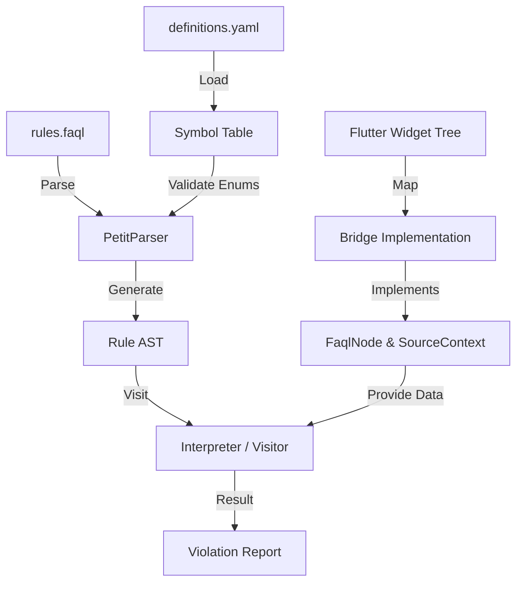

# FAQL v3.4 Implementation Guide

**Target System:** Dart / Flutter Analysis Server
**Architecture:** Tree-Walking Interpreter (Visitor Pattern)
**Dependencies:** `petitparser`, `yaml`

## 1\. System Architecture

The FAQL engine is a decoupled library. It does not import `package:flutter`. Instead, it relies on an Abstract Interface (`FaqlNode`) that the host application (the Linter) must implement.


```mermaid
graph TD
    Config[definitions.yaml] -->|Load| SymbolTable[Symbol Table]
    RuleFile[rules.faql] -->|Parse| Parser[PetitParser]
    SymbolTable -->|Validate Enums| Parser
    Parser -->|Generate| AST[Rule AST]
    
    Flutter[Flutter Widget Tree] -->|Map| Bridge[Bridge Implementation]
    Bridge -->|Implements| Interface[FaqlNode & SourceContext]
    
    AST -->|Visit| Interpreter[Interpreter / Visitor]
    Interface -->|Provide Data| Interpreter
    Interpreter -->|Result| Report[Violation Report]
```

-----

## 2\. The Data Layer (Configuration)

FAQL v3.4 requires strict Enum validation. You must load valid roles and kinds from an external schema before parsing begins.

**File:** `definitions.yaml`

```yaml
# Used to validate 'role(Role.button)'
roles:
  button: [SemanticsFlag.isButton]
  toggle: [SemanticsFlag.isToggled]
  textField: [SemanticsFlag.isTextField]
  slider: [SemanticsFlag.isSlider]
  header: [SemanticsFlag.isHeader]

# Used to validate 'kind(Kind.input)'
kinds:
  input: [textField, slider, switch, checkbox]
  action: [button, toggle, link]
```

**Class:** `SymbolTable`

```dart
class SymbolTable {
  final Set<String> _validRoles = {};
  final Map<String, List<String>> _kinds = {};

  void load(String yamlContent) {
    // Parse YAML and populate sets
  }

  bool isValidRole(String name) => _validRoles.contains(name);
  bool isValidKind(String name) => _kinds.containsKey(name);
  
  /// Resolves a macro kind into a list of generic roles
  List<String> resolveKind(String kindName) => _kinds[kindName] ?? [];
}
```

-----

## 3\. The Runtime Type System (`SafeValue`)

FAQL uses a "Monad-like" wrapper to handle `null` safely (Safe Navigation) and provide distinct behavior for Lists vs Primitives.

**File:** `src/runtime/safe_value.dart`

```dart
enum ValueType { string, int, bool, list, node, nullValue }

class SafeValue<T> {
  final T? _value;
  final ValueType type;

  SafeValue(this._value) : type = _determineType(T);
  SafeValue.nullValue() : _value = null, type = ValueType.nullValue;

  bool get isNull => type == ValueType.nullValue;

  /// 1. Equality (Standard)
  /// null == null -> True
  /// null == "a"  -> False
  bool equals(SafeValue other) {
    if (this.isNull && other.isNull) return true;
    if (this.isNull || other.isNull) return false;
    return _value == other._value;
  }

  /// 2. String Matching (Fluent)
  /// Implements: label.matches("text")
  bool matches(String pattern) {
    if (isNull || type != ValueType.string) return false;
    final str = _value as String;
    return str.trim().toLowerCase() == pattern.trim().toLowerCase();
  }

  /// 3. Indexing
  /// Implements: ancestors[0] OR label[0]
  SafeValue operator [](int index) {
    if (isNull) return SafeValue.nullValue();
    
    if (type == ValueType.list) {
      final list = _value as List;
      if (index < 0 || index >= list.length) return SafeValue.nullValue();
      return SafeValue(list[index]); // Return the Node/Item
    }
    
    if (type == ValueType.string) {
      final str = _value as String;
      if (index < 0 || index >= str.length) return SafeValue.nullValue();
      return SafeValue(str[index]); // Return 1-char String
    }
    
    return SafeValue.nullValue();
  }
}
```

-----

## 4\. The Bridge Interfaces (The Contract)

This is the most critical part. Your Linter must implement these two interfaces to bridge the **Semantic Graph** and the **Widget AST**.

**File:** `src/bridge/interfaces.dart`

### 4.1 The Semantic Node (`this`)

Used for Traversal and Computed Properties.

```dart
abstract class FaqlNode {
  // --- Identity ---
  /// The resolved role string (e.g., 'button').
  String get role;
  
  // --- State Variables ---
  bool get isFocusable;
  bool get isEnabled;
  bool get isChecked;
  bool get isToggled;
  bool get isHidden;
  
  String? get label;
  String? get hint;
  String? get value;

  // --- Graph Navigation ---
  /// Immediate parent. Returns null if root.
  FaqlNode? get parent;
  
  /// Immediate children (Depth 1).
  List<FaqlNode> get children;
  
  /// Recursive flat list of all nodes below this one.
  List<FaqlNode> get descendants;
  
  /// Siblings (children of parent, excluding self).
  List<FaqlNode> get siblings;

  // --- Helpers (Can be default implemented) ---
  FaqlNode? get firstChild => children.isNotEmpty ? children.first : null;
  FaqlNode? get lastChild => children.isNotEmpty ? children.last : null;
  FaqlNode? get onlyChild => children.length == 1 ? children.first : null;

  // --- Bridge to Source ---
  /// Returns the Source Context for the widget that created this node.
  SourceContext get source;
}
```

### 4.2 The Source Context (`widget`)

Used for AST Configuration Checks.

```dart
abstract class SourceContext {
  /// Implements: widget<T>("name")
  /// Must return SafeValue.nullValue() if the param is missing or wrong type.
  SafeValue<T> getParameter<T>(String name);

  /// Implements: ... is defined
  /// Must return true ONLY if the parameter is explicitly present in the AST.
  bool isParameterDefined(String name);
}
```

-----

## 5\. Parser Strategy (PetitParser)

You need to parse generic syntax `widget<int>` and method calls `.matches()`.

**File:** `src/grammar/faql_grammar.dart`

```dart
// Snippet of the grammar definition
class FaqlGrammar extends GrammarDefinition {
  @override
  Parser start() => ref0(ruleUnit).end();

  // ... (Standard rules for rule_unit, body, etc) ...

  // 1. Parsing 'widget<type>("name")'
  Parser widgetAccess() =>
      string('widget') &
      char('<') & typeParam() & char('>') &
      char('(') & stringLiteral() & char(')');

  // 2. Parsing 'label.matches("text")'
  Parser fluentMatch() =>
      string('matches') & char('(') & stringLiteral() & char(')');

  // 3. Parsing 'list[index]'
  Parser indexAccess() =>
      identifier() & char('[') & digit().plus() & char(']');
      
  // 4. Parsing 'role(Role.name)'
  Parser roleSelector() =>
      string('role') & char('(') & 
      string('Role.') & identifier() & // Validate identifier against SymbolTable here if possible
      char(')');
}
```

-----

## 6\. The Interpreter (Visitor Pattern)

This is the engine that executes the logic. It maintains the state of "Current Context".

**File:** `src/runtime/interpreter.dart`

```dart
class Interpreter implements FaqlVisitor<SafeValue> {
  final FaqlNode currentNode; // 'this'
  final SymbolTable symbols;

  Interpreter(this.currentNode, this.symbols);

  /// Main Entry Point
  bool evaluateRule(RuleAST ast) {
    // 1. Check Scope
    if (!matchesSelector(ast.selector, currentNode)) return true; // Skip
    
    // 2. Check Guard (When)
    if (ast.whenClause != null) {
      final guard = visit(ast.whenClause);
      if (!guard.isTruthy) return true; // Skip
    }

    // 3. Check Assertion (Ensure)
    final result = visit(ast.ensureClause);
    return result.isTruthy; // False = Violation
  }

  // --- Visitor Methods ---

  @override
  SafeValue visitWidgetAccess(WidgetAccessNode node) {
    // SWITCH CONTEXT: Use currentNode.source
    final src = currentNode.source;
    
    // Handle Generic Casting at Runtime
    switch (node.genericType) {
      case 'int': return src.getParameter<int>(node.paramName);
      case 'bool': return src.getParameter<bool>(node.paramName);
      case 'string': return src.getParameter<String>(node.paramName);
      default: return SafeValue.nullValue();
    }
  }

  @override
  SafeValue visitStateCheck(StateCheckNode node) {
    // Implements 'is defined'
    final isDef = currentNode.source.isParameterDefined(node.paramName);
    return SafeValue(isDef);
  }

  @override
  SafeValue visitTraversal(TraversalNode node) {
    // 1. Resolve the Base (children, ancestors, etc)
    List<FaqlNode> collection = _resolveRelation(node.relation);

    // 2. Handle Aggregators (.any, .none)
    if (node.aggregator != null) {
      return _evaluateAggregator(collection, node.aggregator!);
    }
    
    // 3. Handle Closest (Special Case)
    if (node.relation == 'closest') {
      return _findClosest(currentNode, node.selector);
    }

    return SafeValue(collection);
  }

  // --- Logic Helpers ---

  SafeValue _findClosest(FaqlNode start, SelectorAST selector) {
    FaqlNode? pointer = start.parent;
    while (pointer != null) {
      if (matchesSelector(selector, pointer)) {
        return SafeValue(pointer);
      }
      pointer = pointer.parent;
    }
    return SafeValue.nullValue();
  }

  SafeValue _evaluateAggregator(List<FaqlNode> items, AggregatorAST agg) {
    for (var item in items) {
      // Create a sub-interpreter for the scope variable 'it'
      // Note: In real impl, pass a Scope map to the Visitor
      final subInterp = Interpreter(item, symbols);
      final result = subInterp.visit(agg.expression);
      
      if (agg.type == 'any' && result.isTruthy) return SafeValue(true);
      if (agg.type == 'none' && result.isTruthy) return SafeValue(false);
      // ... handle .all
    }
    // Default returns
    return SafeValue(agg.type == 'none' ? true : false);
  }
}
```

-----

## 7\. Error Handling Strategy

### 7.1 Compiler Errors (Parse Time)

These prevent the linter from starting.

* **Unknown Enum:** User types `Role.btn`. -\> *Action: Throw ParseException.*
* **Syntax Error:** User misses a closing brace. -\> *Action: Throw ParseException.*

### 7.2 Logic Failures (Runtime)

These cause a rule to fail (violation) or skip, but do not crash the linter.

* **Type Mismatch:** `widget<int>("val")` returns a String in reality. -\> *Action: Return `SafeValue.null`.*
* **Index Out of Bounds:** `children[5]`. -\> *Action: Return `SafeValue.null`.*

### 7.3 Infinite Loop Protection

* **Cycle Detection:** When traversing `descendants` in a graph that might have cycles (unlikely in Flutter, but possible in custom implementations), keep a `Set<FaqlNode> visited`. If a node is revisited, stop recursion.
